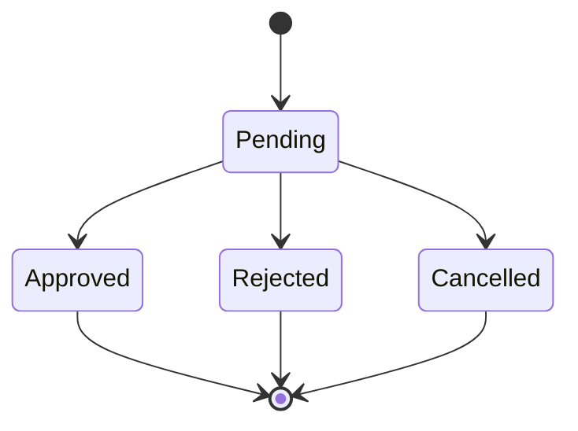
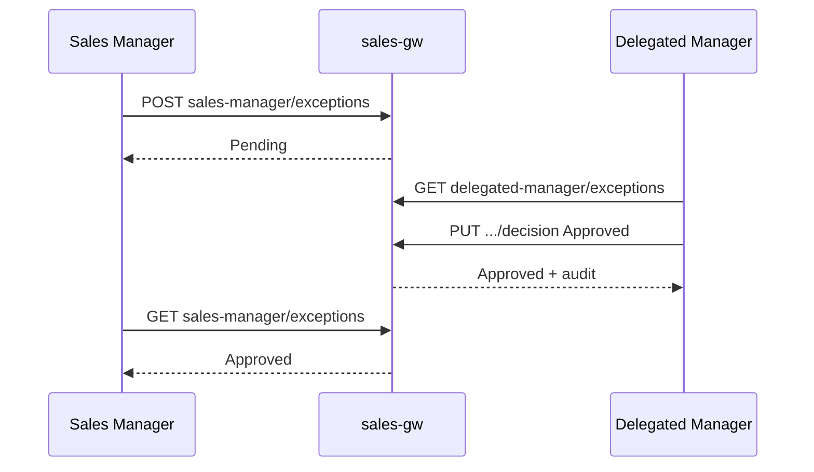

# Delegated Manager API

Base URL examples:

| Env | Base |
|-----|------|
| Demo | `http://169.58.236.52:8080/sales-gw/api/` |
| Local | `http://127.0.0.1:5280/api/` |
| Production | `http://admincompany.alsaaeidy.com/sales-gw/api/` |

Auth header: `Authorization: Bearer <jwt>`

Arabic role claim `UserType`:

| Role | UserType | Policy |
|------|----------|--------|
| Delegated Manager | `مدير مفوض` | `Sales.DelegatedManager` |
| Sales Manager | `مدير مبيعات` | `Sales.Manager` |

---

## 1. Authentication

### POST `Auth/LoginDelegatedManager`

**Purpose:** Central login (no province).  
**Auth:** none  
**Body:**
```json
{ "userName": "dm1", "password": "***" }
```
**200:**
```json
{
  "token": "<jwt>",
  "expiration": "2026-09-16T00:00:00Z",
  "userId": 0,
  "userName": "المدير المفوض",
  "userType": "مدير مفوض",
  "cityLink": "",
  "cityName": "كل المحافظات",
  "cityValue": "",
  "central": true
}
```
**400** invalid credentials · **500** server error

---

## 2. Dashboard

### GET `delegated-manager/dashboard`

**Policy:** DelegatedManager  
**200:** unread complaint count + pending exception count (see live controller).

---

## 3. Complaints / Inbox

### GET `delegated-manager/complaints`

**Policy:** DelegatedManager  
**Query:** `page`, `pageSize`, `unreadOnly`, `cityValue`, `sourceApp`, `search`  
**200:** `{ page, pageSize, totalCount, totalPages, items[] }`

### GET `delegated-manager/complaints/unread-count`

### GET `delegated-manager/complaints/{id}`

### PUT `delegated-manager/complaints/{id}/read`

### PUT `delegated-manager/complaints/read-all`

**404** missing · **401/403** auth

---

## 4. Complaint submission (future apps)

### POST `complaints`

**Auth:** any authenticated gateway JWT  
**Body:** `subject`, `body`, optional `cityValue`, `cityName`, `sourceApp`, `sourceType`, `metadataJson`  
**Identity:** taken from JWT claims — caller identity fields in body are ignored.  
**200** created · **400** validation · **401** unauthenticated

---

## 5. Exception Requests (Sales Manager)

### POST `sales-manager/exceptions`

**Policy:** SalesManager  
**Body:**
```json
{
  "cityValue": "najaf-demo",
  "cityName": "النجف - DEMO",
  "customerId": 12,
  "customerName": "…",
  "customerPhone": "…",
  "salesRequestId": 99,
  "reason": "…",
  "targetApproverType": "DelegatedManager"
}
```
**200** Pending created · **400** invalid · **403** wrong role

### GET `sales-manager/exceptions`

### GET `sales-manager/exceptions/{id}`

### PUT `sales-manager/exceptions/{id}/cancel` — only while Pending

---

## 6. Exception Decisions (Delegated Manager)

### GET `delegated-manager/exceptions`

**Query:** `status`, `cityValue`, `page`, `pageSize`

### GET `delegated-manager/exceptions/{id}`

### PUT `delegated-manager/exceptions/{id}/decision`

**Body:**
```json
{ "decision": "Approved", "note": "optional" }
```
`decision`: `Approved` | `Rejected` (and Cancelled only via SM cancel path).

**200** updated · **404** missing · **409** already decided · **403** unauthorized

**State machine:**




---

## 7. Sales Manager Exception Views

Use GET `sales-manager/exceptions?status=Pending|Approved|Rejected`.  
After approval, UI shows: «تمت الموافقة على الاستثناء من قبل المدير المفوض». Assign/prepare still use existing sales-request endpoints.

---

## 8. Mobile Update API

### GET `mobile-updates/{appKey}`

Example: `mobile-updates/delegated-manager`  
**Auth:** none or any (check controller)  
**200:**
```json
{
  "latestVersionName": "1.1.0",
  "latestVersionCode": 11,
  "minimumSupportedVersionCode": 10,
  "forceUpdate": false,
  "apkUrl": "https://…",
  "sha256": "…",
  "releaseNotes": "…",
  "updateKind": "Optional"
}
```
Rules: `current >= latest` → none; `current < minimum` → mandatory; `forceUpdate` → mandatory; else optional.

---

## 9. Environment / base URLs

Flutter `--dart-define=APP_ENV=demo|production|local` and optional `API_BASE_URL` / `API_BASE`.  
Demo never resolves to production hosts; production never falls back to demo IP.

---

## 10. Status meanings

| Entity | Status | Meaning |
|--------|--------|---------|
| Complaint | Unread / Read | Inbox visibility |
| Exception | Pending | Awaiting DM |
| Exception | Approved | DM approved; SM may continue assign flow |
| Exception | Rejected | DM rejected |
| Exception | Cancelled | SM cancelled while pending |
| TargetApproverType | DelegatedManager / BranchManager | Schema ready; MVP UI only DM |
